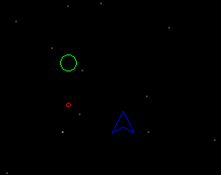
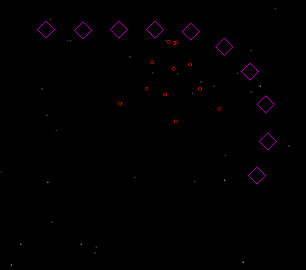
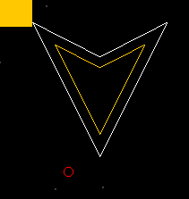
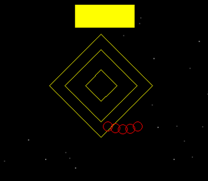
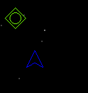
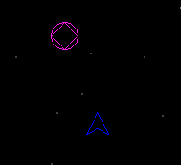

# Documentação do Projeto - Jogo Espacial

## Visão Geral

Este é um jogo de tiro espacial (shoot 'em up) desenvolvido em Java, onde o jogador controla uma nave espacial e deve enfrentar inimigos, bosses e coletar powerups através de múltiplas fases. O projeto utiliza uma arquitetura modular com sistema de configuração baseado em arquivos de texto.

## Estrutura do Projeto

```
epcoutinho/
├── Config/                    # Arquivos de configuração (.txt, alteráveis)
│   ├── gameConfig.txt        # Configurações gerais do jogo
│   ├── phaseConfig.txt       # Configuração de fases
│   └── levels/               # Arquivos de eventos por fase
│       ├── fase1.txt
│       └── fase2.txt
├── Engine/                   
│   ├── gameEngine.java       # Loop principal do jogo; Classe central
│   ├── GameLib.java          # Biblioteca gráfica
│   ├── SceneRenderer.java    # Renderização da cena
│   ├── BackGround.java       # Fundo animado
│   └── ConfigReaders/        # Leitura de arquivos txt de configs
│       ├── GameConfig.java   
│       └── PhaseConfig.java  
├── GameElements/             # Pacote de elementos do jogo
│   ├── Entity.java           # Classe base para entidades
│   ├── GameElement.java      # Classe base para elementos
│   ├── LifeBar.java          # Barra de vida
│   ├── Star.java             # Estrelas de fundo
│   └── Entities/             # Entidades = elementos que interagem
│       ├── Player.java       # Jogador
│       ├── Enemy.java        # Classe base para inimigos
│       ├── Projectile.java   # Classe base para projéteis
│       ├── Powerup.java      # Classe base para powerups
│       ├── EnemyModels/      # Tipos de inimigos (classes próprias)
│       │   ├── Enemy1.java   # Bolinha que atira
│       │   ├── Enemy2.java   # Cobrinha
│       │   ├── Boss.java     # Classe base para bosses
│       │   └── Bosses/       # Tipos de boss (classes próprias)
│       │       ├── Boss1.java
│       │       └── Boss2.java
│       ├── PowerUps/         # Tipos de powerups
│       │   ├── Powerup1.java # Velocidade
│       │   └── Powerup2.java # Escudo
│       └── ProjectileModels/ # Tipos de projéteis (interagem de modo diferente)
│           ├── ProjectilePlayer.java
│           └── ProjectileEnemy.java
├── Manager/                  # Gerenciadores
│   ├── EntityManager.java    # Controle de Atualizações e Colisões
│   ├── SpawnManager.java     # Controle de spawn de entidades
│   └── EntityState.java      # Estados das entidades
├── Exceptions/               # Exceções customizadas
│   ├── HpExcption.java       
│   └── SpawExcption.java     
└── Main.java                 # Ponto de entrada
```

## Arquitetura do Sistema

### 1. Motor do Jogo (Engine)

#### gameEngine.java
- **Responsabilidade**: Loop principal do jogo
- **Funcionalidades**:
  - Inicialização do jogo
  - Controle de tempo (delta time)
  - Coordenação entre Managers
  - Loop de atualização e renderização

#### GameLib.java
- **Responsabilidade**: Interface gráfica e entrada do usuário (já fornecida)
- **Funcionalidades**:
  - Inicialização da janela gráfica
  - Processamento de entrada do teclado
  - Métodos de desenho primitivos

#### SceneRenderer.java
- **Responsabilidade**: Renderização de todos os elementos visuais
- **Funcionalidades**:
  - Desenho do fundo
  - Renderização de entidades
  - Efeitos visuais (explosões, powerups)

### 2. Sistema de Configuração

#### GameConfig.java
- **Responsabilidade**: Leitura das configurações gerais
- **Arquivo lido**: `Config/gameConfig.txt`
- **Configurações**:
  - Parâmetros de entidades (vida, velocidade, raio)
  - Cores dos elementos
  - Configurações específicas de cada tipo de entidade
  - Procura por "keys" do tipo `player.shootingSpeed=100`

#### PhaseConfig.java
- **Responsabilidade**: Leitura e definição de fases e eventos
- **Arquivos lidos**:
  - `Config/phaseConfig.txt`: Configuração geral das fases
  - `Config/levels/fase*.txt`: Eventos (de spawn) específicos de cada fase
- **Funcionalidades**:
  - Carregamento de eventos de spawn
  - Controle de transição entre fases
  - Leitura de modo cronológico, de linha a linha, para cada evento
  - Ignora comentários (linhas começando com #)

### 3. Gerenciadores (Manager)

#### EntityManager.java
- **Responsabilidade**: Gerenciamento de entidades e colisões
- **Funcionalidades**:
  - Detecção de colisões entre entidades
  - Atualização de movimento e estados das entidades
  - Limpeza de entidades inativas
  - Processamento de dano

#### SpawnManager.java
- **Responsabilidade**: Controle de spawn de entidades
- **Funcionalidades**:
  - Spawn baseado em tempo (eventos lidos dos .txt)
  - Controle de fases
  - Gerenciamento de bosses
  - Método de controle especial para Enemy2 (cobrinha)

### 4. Elementos do Jogo (GameElements)

#### Hierarquia de Classes

```
GameElement (base)
├── Entity (entidades interativas)
│   ├── Player (jogador)
│   ├── Enemy (inimigos)
│   │   ├── Enemy1 (inimigo simples)
│   │   ├── Enemy2 (cobrinha)
│   │   └── Boss (bosses)
│   │       ├── Boss1 (boss de aparência "player")
│   │       └── Boss2 (boss cubo doido)
│   ├── Projectile (projéteis)
│   │   ├── ProjectilePlayer
│   │   └── ProjectileEnemy
│   └── Powerup (powerups)
│       ├── Powerup1 (velocidade)
│       └── Powerup2 (escudo)
├── LifeBar (barra de vida)
├── Star (estrelas de fundo)
└── BackGround (fundo animado)
```

## Mecânicas do Jogo

### Controles
- **Setas direcionais**: Movimentação do jogador
- **Ctrl**: Disparo de projéteis
- **ESC**: Sair do jogo

### Sistema de Vida
- Jogador possui HP configurável (phaseConfig.txt)
- Inimigos e bosses têm HP específicos (GameConfig.txt)
- Sistema de invulnerabilidade temporária após dano

### Tipos de Inimigos

#### Enemy1
- Movimento apenas vertical
- Dispara projéteis simples



#### Enemy2
- Múltiplos segmentos (estruturas de corpo idependentes)
- Movimento dos segmentos em fila, de "cobra"
- Dispara vários projéteis (nmro dependente da qntd de segmentos) em leque



### Bosses

#### Boss1
- **Características**: Boss tipo "Player", pode entrar em estado invulnerável (escudo)
- **Ataques**: 
  - Tiro normal
  - Ataque especial com projéteis grandes
- **Mecânica**: Alterna entre modo normal e super ataque



#### Boss2
- **Características**: Boss "Cubo doido"
- **Ataques**:
  - Múltiplos projéteis simultâneos (em leque)
  - Movimento vertical agressivo
- **Mecânica**: Muda de posição durante ataques



### Powerups

#### Powerup1
- **Efeito**: Aumenta velocidade do jogador
- **Duração**: 3 segundos (padrão)
- **Visual**: Gradiente verde-amarelo



#### Powerup2
- **Efeito**: Reduz velocidade dos inimigos
- **Duração**: 10 segundos (padrão)
- **Visual**: Gradiente amarelo-magenta



## Sistema de Fases

### Estrutura de Arquivos de Fase

Cada arquivo de fase (`fase*.txt`) contém eventos cronológicos:

```
# Comentários são ignorados
INIMIGO <TIPO> <QUANDO> <X> <Y>
POWERUP <TIPO> <QUANDO> <X> <Y>
CHEFE <TIPO> <HP> <QUANDO> <X> <Y>
```

### Exemplo de Fase
```
# Fase 1
INIMIGO 2 1500 120 50    # Enemy2 no tempo 1500ms
INIMIGO 1 2500 180 50    # Enemy1 no tempo 2500ms
POWERUP 1 3000 160 50    # Powerup1 no tempo 3000ms
CHEFE 1 10 8000 200 50   # Boss1 com 10 HP no tempo 8000ms
```

## Sistema de Colisões

### Tipos de Colisão Implementados
1. **Player ↔ Inimigos**: Dano ao jogador e inimigo
2. **Player ↔ Projéteis Inimigos**: Dano ao jogador
3. **Projéteis Player ↔ Inimigos**: Dano ao inimigo
4. **Player ↔ Boss**: Dano ao jogador
5. **Projéteis Player ↔ Boss**: Dano ao boss
6. **Player ↔ Powerups**: Ativação do powerup

### Detecção de Colisão
- Baseada em distância euclidiana
- Considera raios das entidades
- Fator de tolerância aplicado (0.8)

## Configuração do Jogo

### Arquivo gameConfig.txt
Contém todas as configurações numéricas do jogo:
- Velocidades, raios, tempos
- Cores dos elementos
- Parâmetros específicos de cada entidade

### Personalização
Para modificar o jogo, edite:
1. `gameConfig.txt` para ajustar parâmetros
2. `phaseConfig.txt` para alterar número de fases
3. `fase*.txt` para criar novos padrões de inimigos

## Compilação e Execução

### Pré-requisitos
- Java JDK 8 ou superior

### Compilação
```bash
javac -cp . epcoutinho/*.java epcoutinho/*/*.java epcoutinho/*/*/*.java
```

### Execução
```bash
java epcoutinho.Main
```

## Extensibilidade

### Adicionando Novos Tipos
1. **Novo Inimigo**: Estender `Enemy` e adicionar ao `SpawnManager`
2. **Novo Boss**: Estender `Boss` e implementar lógica específica
3. **Novo Powerup**: Estender `Powerup` e definir efeitos
4. **Nova Fase**: Criar arquivo de fase e atualizar `phaseConfig.txt`

### Modificações de Comportamento
- Alterar parâmetros em `gameConfig.txt`
- Modificar lógica de colisão em `EntityManager`
- Ajustar padrões de spawn em `SpawnManager`

## Conclusão

Este projeto demonstra uma arquitetura bem estruturada para jogos 2D em Java, com:
- Separação clara de responsabilidades
- Sistema de configuração flexível
- Gerenciamento eficiente de entidades
- Código extensível e manutenível

O sistema permite fácil modificação e adição de novos elementos, mantendo a organização e performance do jogo. 